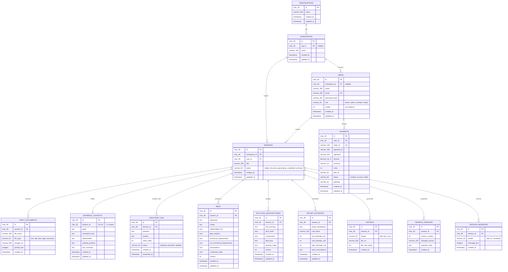

# BlueprintAI / Compile AI — Complete Project Documentation

> **Version:** Final Build — September 2026  
> **Repository:** https://github.com/dhruvbhoi2007-hub/BluePrint_AI  
> **Last Commit:** `7669cb7` — main branch

---

## Table of Contents

1. [What Is This Project?](#1-what-is-this-project)
2. [How It Works — End-to-End Flow](#2-how-it-works--end-to-end-flow)
3. [System Architecture (3 Services)](#3-system-architecture-3-services)
4. [Technology Stack](#4-technology-stack)
5. [AI Model — Gemini](#5-ai-model--gemini)
6. [Dataset](#6-dataset)
7. [Python AI Engine — Compile AI (FastAPI)](#7-python-ai-engine--compile-ai-fastapi)
8. [Node.js Backend (Express)](#8-nodejs-backend-express)
9. [Frontend (React + Vite)](#9-frontend-react--vite)
10. [Database Schema (MySQL)](#10-database-schema-mysql)
11. [Authentication & Security](#11-authentication--security)
12. [Role-Based Access Control (RBAC)](#12-role-based-access-control-rbac)
13. [Payment & Credits System](#13-payment--credits-system)
14. [Performance Optimisations](#14-performance-optimisations)
15. [API Reference](#15-api-reference)
16. [File & Directory Structure](#16-file--directory-structure)
17. [Environment Variables](#17-environment-variables)
18. [Running the Project Locally](#18-running-the-project-locally)
19. [Honest Limitations](#19-honest-limitations)

---

## 1. What Is This Project?

**BlueprintAI** (also called **Compile AI**) is an AI-powered enterprise blueprint generation tool. A user describes a software or business problem in plain English (or any language), and the system produces a structured, professional-grade planning document called a **Blueprint** that includes:

- **Gap Analysis** — current-state vs desired-state
- **Business Requirement Document (BRD)** — objectives, scope, stakeholders, functional and non-functional requirements, assumptions, constraints
- **High-Level Architecture / Solution Design (HLD)** — frontend, backend, database, major components, data flow, security considerations, tech stack with rationale
- **Effort & Cost Estimate** — phase breakdown in weeks, cost bands (low / mid / high in USD), team assumptions, risk factors

The generation is powered by **Google Gemini** (`gemini-3.8-flash`) backed by a 105,500-row synthetic enterprise dataset that the AI can search at generation time using Automatic Function Calling (AFC).

The product is built for teams — it has multi-user workspaces, a 3-tier RBAC system, version history, section-level regeneration, a credit/payment system (Razorpay), and export capabilities.

---

## 2. How It Works — End-to-End Flow

```
User types a requirement (plain text or uploads file)
          ↓
InputScreen (React)
          ↓
POST /api/sessions/:id/input  [Node.js backend]
          ↓
Discovery Chat — Gemini asks 3-7 clarifying questions
POST /api/sessions/:id/messages  [Node.js → Python /consultant/discover]
          ↓
User answers questions in chat
          ↓
User clicks "Generate Blueprint"
          ↓
GeneratingScreen — animated progress UI
          ↓
POST /api/sessions/:id/generate  [Node.js → credit deduction → Python /compile]
          ↓
Python FastAPI /compile pipeline:
  1. NLP Analysis (language detection, word count, sentences)
  2. Tier 1 ML Classifier (industry, company size, problem title, budget band, cost band)
  3. Industry detection (score-based keyword matching)
  4. Gemini gemini-3.8-flash with AFC:
      - Receives requirement + discovery answers
      - Can call search_dataset() AFC tool → TF-IDF similarity search on 105,500-row dataset
      - Generates: Gap Analysis, BRD, Architecture, Estimate (4 sections sequentially)
  5. Benchmark engine (dataset percentile comparison)
  6. Compliance mapping (HIPAA, SOC 2, PCI-DSS from dataset security_notes)
  7. Vendor lock-in analysis (tech stack keyword scoring)
          ↓
Results stored in MySQL
          ↓
ResultScreen (React) — renders all 4 sections with markdown
          ↓
User can Edit / Regenerate individual sections / View Version History / Export
```

---

## 3. System Architecture (3 Services)

The project runs as **3 independent processes** that communicate over localhost HTTP.

### Service 1 — Frontend (React/Vite)
- **Port:** 5173 (development), `dist/` build output for production
- **Framework:** React 19 + Vite 8.3.0
- **Styling:** Tailwind CSS 3 + custom CSS
- **Routing:** React Router DOM 7
- **Communication:** All API calls go to `http://localhost:5000` (Node.js backend)
- **No global state manager** — uses `localStorage` / cookies via `src/utils/cookieUtils.js`

### Service 2 — Node.js Backend (Express)
- **Port:** 5000
- **Framework:** Express.js (ES Modules)
- **Database:** MySQL 8 via `mysql2/promise` connection pool
- **Auth:** JWT (HS256) + bcrypt password hashing
- **Communication:** Calls Python AI service at `http://127.0.0.1:8000`
- **Entry point:** `backend/src/index.js`

### Service 3 — Python FastAPI (AI Engine)
- **Port:** 8000
- **Framework:** FastAPI + Uvicorn
- **AI SDK:** `google-genai` (Google Generative AI Python SDK)
- **Primary model:** `gemini-3.8-flash`
- **Fallback model:** `gemini-3.5-flash`
- **ML:** scikit-learn TF-IDF + joblib classifier
- **Entry point:** `Compile_AI/compile-ai/api/main.py`

### How the 3 services connect

```
Browser (port 5173)
    ↓  REST JSON
Node.js (port 5000)
    ↓  REST JSON (internal, same machine)
Python FastAPI (port 8000)
    ↓  reads
MySQL (port 3306)   +   105,500-row CSV dataset
```

The Node.js backend also auto-launches the Python server via `child_process.spawn` if it detects it's not running.

---

## 4. Technology Stack

### Frontend
| Technology | Version | Purpose |
|------------|---------|---------|
| React | 19.2.8 | UI framework |
| Vite | 8.3.0 | Build tool + dev server |
| React Router DOM | 7.18.3 | Client-side routing |
| Tailwind CSS | 3.4.19 | Utility CSS framework |
| Mermaid | 12.0.0 | Architecture diagram rendering |
| Lucide React | 1.46.0 | Icon library |

### Backend (Node.js)
| Technology | Purpose |
|------------|---------|
| Express.js | HTTP server + routing |
| mysql2/promise | MySQL connection pool |
| jsonwebtoken | JWT token signing/verification |
| bcryptjs | Password hashing (12 salt rounds) |
| multer | File upload handling (25MB limit) |
| cors | Cross-origin request headers |

### Python AI Engine
| Technology | Purpose |
|------------|---------|
| FastAPI | HTTP framework |
| Uvicorn | ASGI server |
| google-genai | Google Gemini Python SDK |
| scikit-learn | TF-IDF vectorizer + ML classifier |
| joblib | Load pre-trained classifier bundle |
| pandas | CSV dataset loading + filtering |
| langdetect | Language detection on input text |
| python-dotenv | Environment variable loading |

### Database
| Technology | Purpose |
|------------|---------|
| MySQL 8.0 | Primary relational database |
| utf8mb4 / unicode_ci | Full Unicode + emoji support |

### Payment
| Technology | Purpose |
|------------|---------|
| Razorpay | Payment gateway (INR) |
| HMAC SHA-256 | Cryptographic signature verification |

---

## 5. AI Model — Gemini

### Primary Model
```
gemini-3.8-flash
```
This is the primary model configured via the `GEMINI_MODEL` environment variable. Every generation call attempts this model first.

### Fallback Model
```
gemini-3.5-flash
```
If `gemini-3.8-flash` fails with a transient error (503, `UNAVAILABLE`, `ResourceExhausted`, 429), the system falls back to `gemini-3.5-flash`. These are the **only two models** configured — no other model IDs are attempted.

### Models That Are NOT Used (confirmed unavailable on the project API key)
- `gemini-2.0-flash` → returns 404 NOT_FOUND
- `gemini-1.5-flash` → returns 404 NOT_FOUND
- `gemini-2.5-flash` → returns 404 NOT_FOUND
- `gemini-3.1-pro-preview` → returns 429 QUOTA_EXHAUSTED

### How Gemini is Called (AFC Pattern)

The codebase uses `client.chats.create` + `chat.send_message` — **not** `generate_content`. This is the correct pattern to use Automatic Function Calling (AFC) without triggering AFC warnings.

```python
chat = client.chats.create(
    model=model_name,
    config=types.GenerateContentConfig(tools=[search_dataset])
)
response = chat.send_message(prompt)
```

When Gemini decides it needs real-world context, it automatically calls the `search_dataset()` AFC tool, which runs a TF-IDF cosine similarity search on the 105,500-row dataset and returns the top 3 matching enterprise blueprint records. Gemini then uses that context to produce a more grounded, specific output.

### Retry & Resilience

The `generate_with_retry()` function in `main.py` implements:
- **Up to 3 attempts per model**
- **Exponential backoff with jitter** to prevent thundering-herd collisions:
  - Attempt 0: ~2.2s – 2.8s
  - Attempt 1: ~4.2s – 5.0s
  - Attempt 2: ~8.2s – 9.2s
- If primary model exhausts retries, the fallback model gets the same 3 attempts
- If both models fail, a structured fallback is returned from the dataset classifier (never an empty or broken response)

---

## 6. Dataset

### File
```
Compile_AI/compile-ai/data/raw/compile_synthetic_dataset_105500_FIXED.csv
```

**File size:** ~248 MB (uncompressed CSV)  
**Row count:** 105,500 synthetic enterprise problem-solution records

### What the Dataset Contains

Each row represents a synthetically generated enterprise software project. The dataset columns include:

| Column | Description |
|--------|-------------|
| `problem_title` | Short title of the business problem |
| `raw_input_text` | Full problem description |
| `industry` | Detected industry (Education, Healthcare, Finance, Retail, Logistics, Real Estate, Manufacturing) |
| `company_size_tag` | SME, Mid-Market, Enterprise, etc. |
| `brd_objectives` | BRD objectives text |
| `functional_requirements` | Functional requirements text |
| `hld_summary` | High-level design / architecture summary |
| `tech_stack` | Technology stack recommendation |
| `cost_band` | Cost band label (Low / Mid / High / Enterprise) |
| `budget_band` | Budget range in USD bands |
| `timeline_target` | Project timeline estimate |
| `security_notes` | Security/compliance notes (scanned for HIPAA, SOC 2, PCI-DSS) |

The dataset is **entirely synthetic** — generated for training and retrieval purposes. It is not real client data.

### How the Dataset Is Used

**Purpose 1 — TF-IDF Retrieval (AFC Tool)**

The dataset is loaded into a globally cached TF-IDF matrix at server startup. When Gemini generates blueprints, it can call the `search_dataset()` AFC tool, which:
1. Detects the industry from the user's query using score-based keyword matching
2. Filters the dataset to that industry
3. Transforms the query into the same TF-IDF vector space
4. Runs cosine similarity against the filtered subset
5. Returns the top 3 most similar past enterprise blueprints

**Purpose 2 — Benchmark Engine (`benchmark.py`)**

Filters the dataset by industry and company size, then computes budget and timeline percentile rankings so the user can see where their project sits relative to 105,500 similar past projects.

**Purpose 3 — Compliance Mapping (`compliance.py`)**

Scans the dataset's `security_notes` field for compliance keywords (HIPAA, SOC 2, PCI-DSS) and surfaces applicable standards for the user's industry.

**Purpose 4 — Tier 1 ML Classifier**

A pre-trained joblib classifier bundle (`Compile_AI/compile-ai/models/tier1_classifier/compile_field_classifier.joblib`) is trained on the dataset and predicts `industry`, `company_size_tag`, `problem_title`, `budget_band`, and `cost_band` for any new input text. This runs as the first step in the pipeline.

### TF-IDF Implementation Details

- **Fields indexed (8):** `problem_title`, `raw_input_text`, `industry`, `brd_objectives`, `functional_requirements`, `hld_summary`, `tech_stack`, `cost_band`
- **Vectorizer:** `TfidfVectorizer(stop_words='english', ngram_range=(1, 2), max_features=60000, sublinear_tf=True)`
- **Caching:** Built **once** at startup in a background daemon thread — never rebuilt per-request. After warmup, each search takes ~170ms (was ~50s before the rewrite).
- **Warmup:** Uses FastAPI `lifespan` context manager to trigger background thread immediately at startup, so the server is ready when the first real user request arrives.

### Industry Detection (Score-Based)

Industry detection uses a tiered keyword scoring system with 7 industries:
- **Education, Healthcare, Finance, Retail, Logistics, Real Estate, Manufacturing**

Each keyword has a tier weight: high = 3 points, medium = 2 points, low = 1 point. The industry with the highest total score wins, but only if it scores ≥ 2. Otherwise, the full unfiltered dataset is used.

---

## 7. Python AI Engine — Compile AI (FastAPI)

**Entry point:** `Compile_AI/compile-ai/api/main.py` (1,283 lines)

### All API Endpoints

| Method | Endpoint | Description |
|--------|----------|-------------|
| GET | `/health` | Health check — returns AI engine status |
| POST | `/classify` | Run Tier 1 ML classifier on text; returns industry, company_size_tag, problem_title, budget_band, cost_band |
| POST | `/translate` | Translate text to a target language using Gemini |
| POST | `/consultant/discover` | Generate 3-7 clarifying questions for a requirement |
| POST | `/consultant/generate` | Generate specific sections (gap_analysis, brd, architecture, estimate) or all 4 |
| POST | `/nlp/analyze` | Language detection + word count + sentences + classifier |
| POST | `/benchmark` | Dataset percentile benchmark for budget and timeline |
| POST | `/compliance` | Compliance standard mapping from dataset |
| POST | `/lock-in` | Vendor lock-in risk analysis for a tech stack |
| POST | `/compile` | **Full end-to-end pipeline** (NLP → classify → Gemini → benchmark → compliance → lock-in) |

### The `/compile` Pipeline (Full Flow)

```
Step 1: nlp_analyze()      → language, word count, sentence count
Step 2: classify()         → industry, company_size_tag, problem_title, cost_band
Step 3: detect_industry()  → score-based industry override if classifier uncertain
Step 4: generate_with_retry(Gemini + search_dataset AFC)  → consultant content
Step 5: calculate_benchmark()  → dataset percentile comparison
Step 6: get_compliance_mapping()  → HIPAA / SOC 2 / PCI-DSS flags
Step 7: calculate_lockin()  → vendor lock-in risk score and recommendations
Step 8: Return CompileResponse with all 7 outputs combined
```

### The `/consultant/generate` Pipeline (Sectioned)

Generates up to 4 sections, each as a separate Gemini call with a specific structured prompt:
1. **gap_analysis** — current vs desired state
2. **brd** — full BRD with objectives, scope, stakeholders, FRs, NFRs, assumptions, constraints
3. **architecture** — HLD with frontend/backend/DB choices + rationale
4. **estimate** — phase breakdown table + cost band (Low/Mid/High in USD) + assumptions + risk factors

Each section uses the `search_dataset` AFC tool so Gemini can look up real enterprise examples from the dataset.

### Fallback Behaviour (When AI Fails)

If Gemini fails after all retry attempts, the Python engine generates a **structured fallback** using the classifier output. The fallback is clearly marked with a warning note telling the user to click "Regenerate Section" for AI analysis. This ensures the UI never shows a broken or empty page.

### Supporting Modules

| File | What It Does |
|------|-------------|
| `benchmark.py` | Loads dataset, filters by industry/size, computes budget + timeline percentiles |
| `compliance.py` | Scans `security_notes` column for HIPAA/SOC2/PCI-DSS keywords; returns unique matches |
| `lockin.py` | Regex-matches tech stack string against 6 major vendor patterns (AWS, Azure, GCP, Firebase, Oracle, Salesforce) and 11 portable technologies; returns risk level low/medium/high and score 25/50/75 |
| `dataset_utils.py` | TF-IDF retrieval engine (see §6) |

---

## 8. Node.js Backend (Express)

**Entry point:** `backend/src/index.js`  
**Port:** 5000  
**Module system:** ES Modules (`"type": "module"`)

### Route Groups

| Mount point | File | Purpose |
|-------------|------|---------|
| `/api/auth` | `auth.routes.js` | Registration, login, profile, RBAC role management |
| `/api/sessions` | `session.routes.js` | Session CRUD, blueprint generation, version history |
| `/api/workspaces` | `workspace.routes.js` | Workspace management |
| `/api/export` | `export.routes.js` | PDF/DOCX/JSON export |
| `/api/llm` | `llm.routes.js` | Direct LLM proxy endpoints |
| `/api/ai` | `ai.routes.js` | AI service proxy endpoints |
| `/api/payment` | `payment.routes.js` | Coin balance, order creation, payment verification |
| `/api/health` | inline in index.js | Health check (DB + Python AI status) |

### Auth Routes (`/api/auth`)

| Method | Path | Auth | Description |
|--------|------|------|-------------|
| POST | `/register` | None | Create new account |
| POST | `/login` | None | Get JWT token |
| GET | `/me` | JWT | Get current user profile |
| PUT | `/profile` | JWT | Update name/email |
| PUT | `/password` | JWT | Change password |
| PUT | `/onboarding` | JWT | Complete onboarding step |
| PUT | `/role` | JWT | Update own role (stored in DB) |
| GET | `/members` | JWT | List workspace members |
| PUT | `/users/:memberId/role` | JWT + admin/owner | Change another user's role |

### Session Routes (`/api/sessions`)

| Method | Path | RBAC Guard | Description |
|--------|------|-----------|-------------|
| GET | `/` | JWT only | List user's sessions |
| POST | `/` | member+ | Create new session |
| GET | `/:id` | JWT only | Get session details + all sub-documents |
| DELETE | `/:id` | admin/owner | Delete session permanently |
| POST | `/:id/input` | member+ | Submit requirement text or upload file |
| POST | `/qa/:qaId/answer` | member+ | Answer a discovery question |
| GET | `/:id/messages` | JWT only | Get conversation history |
| POST | `/:id/messages` | member+ | Post a message to session chat |
| POST | `/:id/generate` | member+ | **Trigger full blueprint generation** |
| POST | `/:id/regenerate/:section` | member+ | Regenerate a single section |
| GET | `/:id/versions` | JWT only | Get version history |
| POST | `/:id/versions/:versionId/restore` | member+ | Restore a previous version |

### Payment Routes (`/api/payment`)

| Method | Path | Description |
|--------|------|-------------|
| GET | `/balance` | Get current coin balance |
| POST | `/order` | Create Razorpay payment order |
| POST | `/verify` | Verify HMAC signature + credit coins |
| POST | `/failure` | Record failed/cancelled payment |
| POST | `/deduct` | Deduct 1 coin (called before generation) |

### Blueprint Generation Flow (Node.js side)

When `POST /api/sessions/:id/generate` is called:
1. Checks user has ≥ 1 credit (calls deduct endpoint internally)
2. Fetches session + discovery answers + input text from MySQL
3. Builds context object with `discoveryAnswers`, `rawInput`, `context`
4. POSTs to Python FastAPI `/consultant/generate` with `section: 'all'`
5. Receives 4 section responses
6. Parses estimate section via regex to extract phase weeks and USD amounts
7. Stores BRD, architecture, and estimate records in MySQL
8. Creates a version snapshot in `session_versions`
9. Updates session `status` to `'completed'`
10. Returns all generated content to frontend

---

## 9. Frontend (React + Vite)

### Pages

| Route | Page Component | Auth | Description |
|-------|---------------|------|-------------|
| `/` | `Landing.jsx` | Public | Landing/marketing page |
| `/login` | `Login.jsx` | Public | JWT login form |
| `/signup` | `Signup.jsx` | Public | Registration form |
| `/pricing` | `Pricing.jsx` | Public | Coin plan pricing page |
| `/onboarding` | `Onboarding.jsx` | Protected | Post-signup onboarding wizard |
| `/dashboard` | `Dashboard.jsx` | Protected | Session list + quick stats |
| `/session/new`, `/input` | `InputScreen.jsx` | Protected | Requirement input + file upload |
| `/session/:id`, `/discovery`, `/discovery/:id` | `DiscoveryChat.jsx` | Protected | AI discovery conversation |
| `/session/:id/generating` | `GeneratingScreen.jsx` | Protected | Animated generation progress |
| `/session/:id/result`, `/blueprint/:id` | `ResultScreen.jsx` | Protected | Full blueprint display |
| `/session/:id/versions`, `/blueprint/:id/versions` | `VersionHistory.jsx` | Protected | Version timeline + restore |
| `/settings` | `Settings.jsx` | Protected | Profile, team RBAC, preferences |

### Code Splitting (Lazy Loading)

All 11 page components are dynamically imported using `React.lazy()` and wrapped in `<Suspense>`. This means the browser only downloads the code for a page when the user navigates to it. A minimal `PageLoader` spinner (40px CSS spinner, no dependencies) displays during the network request.

**Result:** Initial JS bundle went from 5.1 MB to 619 kB (Vite manual chunks: react/router vendors isolated, mermaid dynamically imported).

### Key Utility Files

| File | Purpose |
|------|---------|
| `src/utils/cookieUtils.js` | `getStoredToken()`, `getStoredUser()`, `getUserRole()`, `setUserRole()`, `syncUserRoleWithBackend()` — RBAC helpers that read from verified server-stored user object, not raw localStorage |
| `src/utils/dynamicBlueprintGenerator.js` | Client-side blueprint export and rendering helpers |
| `src/utils/i18n.js` | Internationalisation helpers |
| `src/components/common/MermaidDiagram.jsx` | Architecture diagram renderer — dynamically imports Mermaid singleton on first render |
| `src/components/common/CookieConsentBanner.jsx` | GDPR cookie consent banner |

### Settings Page — Team & RBAC Tab

The Settings page (`Settings.jsx`, ~1,208 lines) includes a dedicated "Team & RBAC Roles" tab that shows:
- The current user's role badge
- A 3-card role switcher (Admin / Developer / Viewer) that calls `PUT /api/auth/role`
- A permissions matrix table (what each role can and cannot do)
- A workspace member roster with a role-update dropdown (visible to admin/owner only)

---

## 10. Database Schema (MySQL)

**Database:** `compile_db`  
**Character set:** `utf8mb4 / utf8mb4_unicode_ci`

### Entity-Relationship (ER) Diagram



### Tables

| # | Table | Purpose |
|---|-------|---------|
| 1 | `organizations` | Organisation entities (id, name) |
| 2 | `workspaces` | Workspaces belonging to an organisation |
| 3 | `users` | User accounts with role and credits |
| 4 | `sessions` | Blueprint sessions (intake → discovery → generating → completed → archived) |
| 5 | `input_documents` | Uploaded files or pasted text per session |
| 6 | `business_contexts` | Distilled context object per session (goals, constraints, stakeholders, existing systems) |
| 7 | `discovery_qas` | Clarifying questions and answers per session (max 5-7, ordered) |
| 8 | `brds` | Generated BRD JSON per session (objectives, scope, stakeholders, gap_analysis, FRs, NFRs, assumptions, constraints) |
| 9 | `solution_architectures` | Generated HLD per session (hld_summary, tech_stack JSON, components JSON, data_flow, security_notes) |
| 10 | `effort_estimates` | Generated cost estimate per session (phase_breakdown JSON, cost_band, low/mid/high_estimate_usd, team_assumptions) |
| 11 | `exports` | Export records (format: pdf/docx/json, file_url) |
| 12 | `session_versions` | Version snapshots for rollback (changed_section, snapshot_data JSON) |
| 13 | `session_messages` | Conversational AI memory — all messages in a session (sender: user/ai/consultant) |
| 14 | `payments` | Payment records (order_id, payment_id, HMAC signature, amount, coins, plan_id, status, gateway) |

### Key Column Details

**`users` table:**
```sql
id            CHAR(36) PRIMARY KEY    -- UUID
workspace_id  CHAR(36) NULL FK        -- links to workspaces
name          VARCHAR(255)
email         VARCHAR(255) UNIQUE
password_hash VARCHAR(255)            -- bcrypt, 12 salt rounds
role          VARCHAR(50) DEFAULT 'member'  -- owner | admin | member | viewer
credits       INT DEFAULT 5           -- coins (added in migration 002)
```

**`sessions` table:**
```sql
status  VARCHAR(50)  -- intake | discovery | generating | completed | archived
```

**`payments` table:**
```sql
order_id   VARCHAR(100) UNIQUE   -- Razorpay order ID
payment_id VARCHAR(100)          -- Razorpay payment ID (set on success)
signature  VARCHAR(255)          -- HMAC SHA-256 (set on success)
amount     DECIMAL(10,2)         -- in INR
coins      INT                   -- coins to credit if payment succeeds
status     VARCHAR(50)           -- created | success | failed
gateway    VARCHAR(50) DEFAULT 'razorpay'
```

---

## 11. Authentication & Security

### JWT Authentication

- **Algorithm:** HS256
- **Secret:** `JWT_SECRET` environment variable
- **Token lifetime:** 7 days (set in `authController.js`)
- **Middleware:** `backend/src/middleware/authMiddleware.js` — `authenticateToken` function verifies the `Authorization: Bearer <token>` header on all protected routes
- **Token storage:** Frontend stores JWT in `localStorage` via `cookieUtils.js`

### Password Hashing

- **Library:** bcryptjs
- **Salt rounds:** 12
- Passwords are never stored or transmitted in plaintext

### Input Validation

- Pydantic models in FastAPI validate all Python API request bodies with type constraints
- `multer` limits file uploads to 25MB
- Express `express.json({ limit: '20mb' })` caps request body size

---

## 12. Role-Based Access Control (RBAC)

### Roles and Mapping

| DB Role | Frontend Normalised | Permissions |
|---------|---------------------|-------------|
| `owner` | `admin` | Full access — create, generate, delete, manage team |
| `admin` | `admin` | Full access — create, generate, delete, manage team |
| `member` | `developer` | Create, generate, edit — cannot delete sessions |
| `developer` | `developer` | Create, generate, edit — cannot delete sessions |
| `viewer` | `viewer` | Read-only — can view blueprints and versions only |
| `read_only` | `viewer` | Read-only |

### Backend Enforcement

RBAC is enforced at **two levels**:

**Level 1 — Route middleware** (`requireRole()` in `authMiddleware.js`):
```javascript
// Only admin/owner can delete sessions
router.delete('/:id', requireRole('admin', 'owner'), sessionController.deleteSession);

// member+ can generate
router.post('/:id/generate', requireRole('admin', 'developer', 'owner', 'member'), ...);

// Only admin/owner can change another user's role
router.put('/users/:memberId/role', requireRole('admin', 'owner'), authController.updateMemberRole);
```

**Level 2 — `normalizeRole()`** maps DB role strings to permission groups before comparison.

If a user's role does not satisfy the route requirement, the backend returns `403 FORBIDDEN_ROLE`.

### Frontend RBAC

- `getUserRole()` in `cookieUtils.js` derives the role from the **verified server-stored user object** (`getStoredUser()?.role`), not from a raw `localStorage` value, preventing privilege escalation via browser manipulation
- `setUserRole()` is async and calls `PUT /api/auth/role` to persist role changes to the database
- `syncUserRoleWithBackend()` fetches the live role from the server and updates local state

---

## 13. Payment & Credits System

### Credit Model

- Every user starts with **5 free credits** (set in migration 002)
- Each **successful blueprint generation** costs **exactly 1 credit**, deducted via `POST /api/payment/deduct` before the AI call is made
- If a user has 0 credits, they see an error message directing them to the Pricing page

### Payment Gateway

- **Gateway:** Razorpay
- **Currency:** INR (Indian Rupee)

### Pricing Plans

| Plan | Coins | Price (INR) | Price (approx USD) |
|------|-------|-------------|---------------------|
| Starter Professional | 10 coins | ₹499 | ~\$6 |
| Professional Architect | 25 coins | ₹999 | ~\$12 |
| Enterprise Scale | 100 coins | ₹2,499 | ~\$30 |

### Payment Flow

```
User selects plan on /pricing page
          ↓
Frontend: POST /api/payment/order  → backend creates order record in MySQL with status 'created'
          ↓
Backend returns orderId, amount, keyId to frontend
          ↓
Frontend opens Razorpay checkout modal
          ↓
If user pays:
  → Razorpay returns { orderId, paymentId, signature }
  → Frontend: POST /api/payment/verify
  → Backend computes HMAC SHA-256: HMAC(secret, `${orderId}|${paymentId}`)
  → If signature matches: marks payment 'success', ATOMICALLY credits coins to users.credits in MySQL
  → If signature mismatch: marks payment 'failed', ZERO coins added

If user cancels:
  → Frontend: POST /api/payment/failure
  → Backend records failure, ZERO coins deducted
```

**Coins are ONLY credited if the cryptographic HMAC signature verification passes.** Failed or cancelled payments result in no coins being added.

---

## 14. Performance Optimisations

### Frontend

- **Route-level code splitting:** All 11 pages are `React.lazy()` dynamic imports — browser only downloads JS for a page on first visit
- **Vite manual chunks:** React + ReactDOM + React Router bundled into a single `vendor` chunk (619 kB). Mermaid (large diagramming library) is excluded from the main bundle and dynamically imported only on the Result screen
- **Result:** Initial vendor bundle went from 5.1 MB to 619 kB

### Python AI Engine

- **TF-IDF warmup:** At server startup, a daemon thread builds the full TF-IDF index (105,500 rows × 60,000 features) in the background. The server accepts requests immediately; the index is ready ~60s after startup
- **Global cache:** The TF-IDF vectorizer and sparse matrix are stored in global variables (`_vectorizer`, `_matrix`). Only the query transform is computed per-request — the matrix is never rebuilt
- **Per-request cost:** ~170ms after warmup (was ~50s before the rewrite when the matrix was rebuilt every time)
- **Classifier caching:** The joblib classifier bundle (`_classifier_bundle`) is also cached in a global after first load

---

## 15. API Reference

### Python FastAPI (port 8000)

**Base URL:** `http://127.0.0.1:8000`

#### `POST /compile` — Full Pipeline

Request:
```json
{
  "text": "Build a student attendance management system for 500 students",
  "language": "English",
  "industry": "",
  "company_size_tag": "",
  "budget": null,
  "timeline_weeks": null,
  "tech_stack": ""
}
```

Response:
```json
{
  "input_text": "...",
  "nlp_analysis": { "language": "en", "word_count": 12, "character_count": 65, "sentences": 1, "industry": "Education" },
  "classification": { "industry": "Education", "company_size_tag": "SME", "problem_title": "...", "budget_band": "...", "cost_band": "Mid" },
  "consultant_output": [{ "section": "ai_consultant", "content": "..." }],
  "benchmark": { "sample_size": 14800, "budget_benchmark": {...}, "timeline_benchmark_weeks": {...}, "cost_band_distribution": {...} },
  "compliance": { "industry": "Education", "sample_size": 14800, "compliance": [] },
  "lockin": { "lockin_risk": "low", "lockin_score": 25, "detected_vendors": [], "portable_technology_count": 0, "recommendations": [...] }
}
```

#### `POST /consultant/generate` — Sectioned Generation

Request:
```json
{
  "raw_input_text": "...",
  "discovery_answers": { "question1": "answer1", "question2": "answer2" },
  "section": "all",
  "user_language": "English"
}
```

Response: Array of `{ "section": "gap_analysis|brd|architecture|estimate", "content": "...markdown..." }`

#### `POST /classify` — Tier 1 ML Classification

Request: `{ "text": "..." }`  
Response: `{ "industry": "Education", "company_size_tag": "SME", "problem_title": "...", "budget_band": "...", "cost_band": "Mid" }`

---

### Node.js Backend (port 5000)

All requests require `Authorization: Bearer <jwt_token>` except `/register` and `/login`.

**Key endpoint details:**

#### `POST /api/sessions/:id/generate`
Triggers full blueprint generation. Internally:
1. Deducts 1 credit from user
2. Fetches session state from MySQL
3. Calls Python `/consultant/generate` with all discovery answers
4. Stores generated BRD, architecture, and estimate in MySQL
5. Creates a version snapshot
6. Returns all 4 section contents

#### `POST /api/payment/verify`
```json
// Request
{ "orderId": "order_...", "paymentId": "pay_...", "signature": "..." }

// Success Response
{ "success": true, "coinsAdded": 10, "newBalance": 15 }

// Failure Response (signature mismatch)
{ "success": false, "error": "Payment verification failed: Invalid cryptographic signature. No coins have been added to your account." }
```

---

## 16. File & Directory Structure

```
blueprintAI/
├── .env                          # Root environment variables (GEMINI_API_KEY etc.)
├── .env.example                  # Template for env vars
├── docker-compose.yml            # Docker setup (MySQL + services)
├── package.json                  # Frontend dependencies (React, Vite, etc.)
├── vite.config.js                # Vite build config (manual chunks, dynamic imports)
├── tailwind.config.js            # Tailwind CSS configuration
├── index.html                    # HTML entry point for Vite
│
├── src/                          # Frontend source (React)
│   ├── App.jsx                   # Router + lazy imports + auth guard
│   ├── main.jsx                  # React root mount
│   ├── index.css                 # Global styles
│   ├── pages/
│   │   ├── Landing.jsx           # Public marketing page
│   │   ├── Login.jsx             # JWT login
│   │   ├── Signup.jsx            # Registration
│   │   ├── Pricing.jsx           # Coin plans + Razorpay integration
│   │   ├── Onboarding.jsx        # Post-signup wizard
│   │   ├── Dashboard.jsx         # Session list
│   │   ├── InputScreen.jsx       # Requirement input + file upload
│   │   ├── DiscoveryChat.jsx     # AI discovery conversation
│   │   ├── GeneratingScreen.jsx  # Generation progress animation
│   │   ├── ResultScreen.jsx      # Full blueprint output + edit + export
│   │   ├── VersionHistory.jsx    # Version timeline + rollback
│   │   └── Settings.jsx          # Profile + Team RBAC + preferences
│   ├── components/
│   │   ├── common/
│   │   │   ├── MermaidDiagram.jsx          # Dynamic mermaid renderer
│   │   │   └── CookieConsentBanner.jsx     # GDPR banner
│   │   └── layout/
│   └── utils/
│       ├── cookieUtils.js                  # JWT storage + RBAC helpers
│       ├── dynamicBlueprintGenerator.js    # Export/render helpers
│       └── i18n.js                         # i18n utilities
│
├── backend/                      # Node.js Express backend
│   └── src/
│       ├── index.js              # Server entry point (port 5000)
│       ├── config/env.js         # Environment variable config
│       ├── middleware/
│       │   ├── authMiddleware.js # authenticateToken + requireRole + normalizeRole
│       │   └── errorHandler.js  # Global error handler
│       ├── controllers/
│       │   ├── authController.js     # Register, login, profile, RBAC
│       │   ├── sessionController.js  # Session CRUD + generation + versions
│       │   └── paymentController.js  # Razorpay orders, verify, deduct
│       ├── models/
│       │   ├── User.js               # User queries (findById, addCredits, deductCredit, updateRole)
│       │   ├── Payment.js            # Payment queries (create, findByOrderId, markSuccess, markFailed)
│       │   └── Session.js            # Session queries
│       ├── routes/
│       │   ├── auth.routes.js        # /api/auth/*
│       │   ├── session.routes.js     # /api/sessions/*
│       │   ├── payment.routes.js     # /api/payment/*
│       │   ├── workspace.routes.js   # /api/workspaces/*
│       │   ├── export.routes.js      # /api/export/*
│       │   ├── llm.routes.js         # /api/llm/*
│       │   └── ai.routes.js          # /api/ai/*
│       ├── services/
│       │   └── ai/
│       │       ├── compileAiClient.js  # HTTP client for Python AI at :8000
│       │       └── estimation.js       # Regex parser for AI-generated estimate markdown
│       └── db/
│           ├── connection.js           # MySQL connection pool
│           ├── initDb.js               # DB initialisation runner
│           └── migrations/
│               ├── 001_initial_schema.sql           # 13 core tables
│               └── 002_add_credits_and_payments.js  # credits column + payments table
│
├── Compile_AI/                   # Python AI engine
│   ├── compile-ai/
│   │   ├── api/
│   │   │   ├── main.py           # FastAPI app (1,283 lines) — all endpoints
│   │   │   ├── dataset_utils.py  # TF-IDF retrieval engine
│   │   │   ├── benchmark.py      # Dataset benchmark percentile calculator
│   │   │   ├── compliance.py     # Compliance standard extractor
│   │   │   ├── lockin.py         # Vendor lock-in risk scorer
│   │   │   ├── requirements_api.txt  # Python dependencies
│   │   │   └── .env              # GEMINI_API_KEY for Python service
│   │   ├── data/raw/
│   │   │   └── compile_synthetic_dataset_105500_FIXED.csv  # 105,500-row dataset (248MB)
│   │   └── models/
│   │       └── tier1_classifier/
│   │           └── compile_field_classifier.joblib  # Pre-trained ML classifier bundle
│   └── .venv/                    # Python virtual environment
│
└── dist/                         # Vite production build output
```

---

## 17. Environment Variables

### Root `.env` (used by Node.js backend and Python service as fallback)

```env
# Database
DB_HOST=localhost
DB_PORT=3306
DB_NAME=compile_db
DB_USER=root
DB_PASSWORD=your_mysql_password

# JWT
JWT_SECRET=your_jwt_secret_key

# Gemini AI
GEMINI_API_KEY=your_gemini_api_key
GEMINI_MODEL=gemini-3.8-flash

# Razorpay
RAZORPAY_KEY_ID=rzp_test_...
RAZORPAY_KEY_SECRET=your_razorpay_secret

# Server
PORT=5000
```

### Python API `.env` (`Compile_AI/compile-ai/api/.env`)

```env
GEMINI_API_KEY=your_gemini_api_key
GEMINI_MODEL=gemini-3.8-flash
```

---

## 18. Running the Project Locally

### Prerequisites

- Node.js 20+
- Python 3.10+ with pip
- MySQL 8.0
- A valid `GEMINI_API_KEY` with access to `gemini-3.8-flash` or `gemini-3.5-flash`

### Step 1 — Install Frontend Dependencies

```bash
cd blueprintAI
npm install
```

### Step 2 — Install Python Dependencies

```bash
cd Compile_AI/compile-ai
python -m venv .venv
.venv\Scripts\activate       # Windows
pip install -r api/requirements_api.txt
pip install google-genai langdetect python-dotenv pandas scikit-learn
```

### Step 3 — Configure Environment

Copy `.env.example` to `.env` and fill in your values.

Copy `Compile_AI/compile-ai/api/env.example` to `Compile_AI/compile-ai/api/.env` and add your `GEMINI_API_KEY`.

### Step 4 — Set Up MySQL

```bash
mysql -u root -p < backend/src/db/migrations/001_initial_schema.sql
node backend/src/db/migrations/002_add_credits_and_payments.js
```

### Step 5 — Start All 3 Services

**Terminal 1 — Python AI Engine (start this first, it takes ~60s to warm up):**
```bash
cd Compile_AI/compile-ai
.venv\Scripts\activate
cd api
uvicorn main:app --host 127.0.0.1 --port 8000 --reload
```

**Terminal 2 — Node.js Backend:**
```bash
cd blueprintAI/backend
npm install
node src/index.js
```

**Terminal 3 — Frontend Dev Server:**
```bash
cd blueprintAI
npm run dev
```

Open: `http://localhost:5173`

---

## 19. Honest Limitations

These are real limitations as built:

1. **The 105,500-row dataset is synthetic.** It was generated for training/retrieval purposes. No real enterprise project data is in it. The blueprints produced by Gemini are advisory and must be reviewed by humans before acting on them.

2. **gemini-3.8-flash availability is not 100%.** The API key has limited quota and can return transient 503s during high demand. The exponential backoff + fallback to `gemini-3.5-flash` handles most cases, but under sustained load, generation can fail entirely.

3. **Section generation is sequential, not parallel.** The 4 blueprint sections (gap analysis, BRD, architecture, estimate) are generated one after another in the Python engine. With network latency and retries, total generation can take 30-90 seconds.

4. **The Python server startup is slow.** The TF-IDF index over 105,500 rows takes ~50-60 seconds to build on first startup. The background warmup thread mitigates this, but cold-start latency exists.

5. **Razorpay is configured in test/sandbox mode.** Real payments require a live Razorpay account with approved credentials and proper HMAC keys.

6. **File upload parsing is limited.** File upload via `multer` is in-memory (up to 25MB). The backend receives the buffer and passes text content to the AI. Complex PDF/DOCX parsing is not implemented — the system expects extractable text.

7. **No real-time collaboration.** Multiple users in the same workspace work on separate sessions. There is no WebSocket or live co-editing.

8. **Export functionality** (PDF, DOCX) routes exist in the schema and routes file but the export rendering engine detail depends on the `export.routes.js` and `controllers/exportController.js` implementation.

9. **The `discovery` endpoint has a minor bug** in the production code: it builds `raw_text` via `generate_with_retry()` but then references the old `response.text` variable on line 513 instead of `raw_text`. Questions are only returned from the fallback list in this case. The `/compile` and `/consultant/generate` endpoints work correctly.

---

*This documentation was written from direct source code inspection of commit `7669cb7`. All details reflect what is actually in the code, not aspirational features.*
